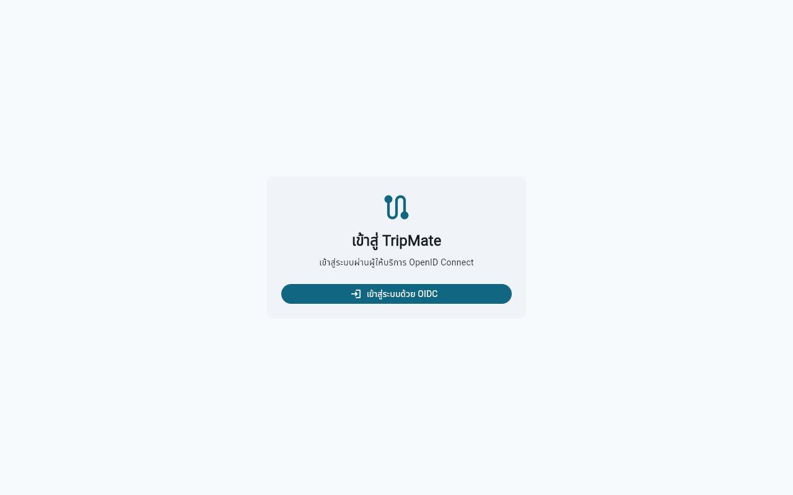
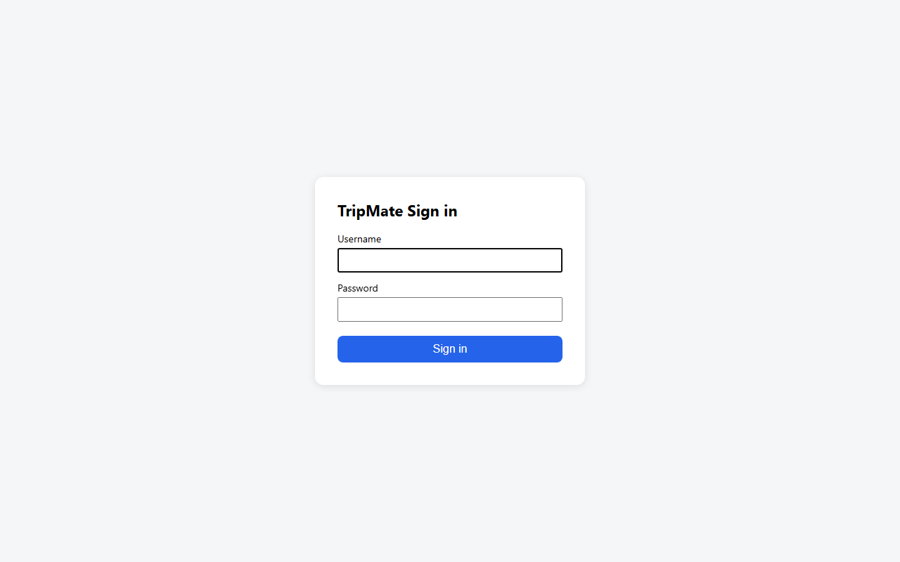

# TripMate — แอปวางแผนทริปและหารค่าใช้จ่ายกลุ่มเพื่อน

TripMate ช่วยให้กลุ่มเพื่อนที่เที่ยวด้วยกันจัดการทริปไว้ในที่เดียว: สร้างทริป จองรายการที่มีจำนวนจำกัด
(ที่พัก การเดินทาง กิจกรรม) แบ่งงานเตรียมทริปด้วยเช็กลิสต์ และบันทึกค่าใช้จ่ายร่วมกัน
โดยระบบคำนวณให้ว่า "ใครต้องโอนให้ใคร เท่าไร" ด้วยจำนวนการโอนน้อยที่สุด

แอปเป็น Flutter (รันบน Chrome) เข้าสู่ระบบผ่าน **OpenID Connect (Authorization Code + PKCE)**
กับ Django + `django-oidc-provider`

## Features

**ฟีเจอร์หลัก**

- ✅ Authentication: Login / Logout ผ่าน OIDC (public client + PKCE), Route Guard ทุกหน้า,
  token เก็บใน `flutter_secure_storage` (ปิดแล้วเปิดแอปใหม่ยังล็อกอินอยู่), Logout ล้าง token และ session ฝั่ง server
- ✅ Create: สร้างทริป / ค่าใช้จ่าย / รายการจอง / งานเตรียมทริป ผ่านฟอร์มที่มี validation
- ✅ Read: รายการทริป (List) และหน้ารายละเอียดทริป (Detail: ภาพรวม, แผนทริป, ค่าใช้จ่าย)
- ✅ Update / Delete: แก้ไข-ลบทริป (เจ้าของทริป), แก้ไข-ลบค่าใช้จ่าย (ผู้จ่ายหรือเจ้าของทริป), ลบงานเตรียมทริป, ติ๊กงานเสร็จ
- ✅ Error Handling: SnackBar / แถบแจ้งเตือนพร้อมปุ่ม "ลองใหม่" เมื่อ backend ปิดหรือ API ล้มเหลว

**Extra Features**

- 🌙 Dark Mode สลับได้และจดจำค่าที่เลือกไว้ (`shared_preferences`)
- 🔍 ค้นหาแบบเรียลไทม์ (ชื่อทริป / จุดหมาย) และเรียงลำดับรายการทริป
- 💸 อัลกอริทึม settlement: คำนวณยอดโอนขั้นต่ำเพื่อเคลียร์ค่าใช้จ่ายของกลุ่ม

## Tech Stack

| ส่วน | เทคโนโลยี |
| --- | --- |
| Frontend | Flutter 3.47 (Dart 3.13), `provider`, `go_router`, `dio`, `openid_client`, `flutter_secure_storage`, `shared_preferences` |
| Architecture | MVVM: View → ViewModel (`ChangeNotifier`) → Repository (Result pattern) → Service (`dio`, OIDC, secure storage) |
| Backend | Django 6.1, Django REST Framework, SQLite |
| OIDC Server | `django-oidc-provider` 0.9 |
| Package manager (backend) | `uv` |

โครงสร้างโค้ด Flutter (`frontend/lib/`):

```text
app.dart, main.dart          # composition root + MultiProvider
core/api, core/auth          # ApiClient (dio), OIDC + token store
core/result, core/theme      # Result pattern, theme + dark mode
core/router                  # go_router + route guard
features/auth/{data,domain,presentation}
features/trip/{data,domain,presentation}
```

## Prerequisites

- [Flutter SDK](https://docs.flutter.dev/get-started/install) (stable, Dart ≥ 3.13)
- [uv](https://docs.astral.sh/uv/getting-started/installation/) (จะติดตั้ง Python 3.13 ให้อัตโนมัติถ้ายังไม่มี)
- [Google Chrome](https://www.google.com/chrome/)
- [Git](https://git-scm.com/downloads)

## How to Run

พอร์ตต้องตรงกันเสมอ: `--web-port 50000` = redirect URI `http://localhost:50000/callback` ที่ลงทะเบียนไว้กับ OIDC client

```bash
git clone -b project https://github.com/chin6112/mobiledev69.git
cd mobiledev69
```

**Terminal 1 — Backend (OIDC Server + API)**

```bash
cd backend
uv sync
uv run manage.py migrate
uv run manage.py setup_oidc      # สร้าง RSA key, OIDC client (public/PKCE) และ demo account
uv run manage.py runserver
```

**Terminal 2 — Flutter Web App**

```bash
cd frontend
flutter pub get
flutter run -d chrome --web-port 50000
```

เมื่อแอปเปิดบน Chrome: กด **เข้าสู่ระบบด้วย OIDC** → หน้า Sign in ของ Django →
กรอก demo account → หน้า Request for Permission กด **Authorize** → กลับเข้าแอป

ทดสอบ backend: `cd backend && uv run manage.py test`  |  ทดสอบ Flutter: `cd frontend && flutter test`

## Demo Account

| Username | Password |
| --- | --- |
| `demo` | `demo-pass-1234` |

(สร้างโดย `uv run manage.py setup_oidc`; รหัสผ่านกรอกที่หน้าของ OIDC Server เท่านั้น ไม่ได้กรอกในแอป)

## Screenshots

| หน้าแรกของแอป (ยังไม่ล็อกอิน) | หน้า Sign in ของ OIDC Server |
| --- | --- |
|  |  |

## Demo Video

🎬 TODO: ใส่ลิงก์วิดีโอ (YouTube unlisted) ที่นี่

## เอกสารเพิ่มเติม

- [docs/TRIPMATE_API.md](docs/TRIPMATE_API.md): ER diagram, enums และ API contract
