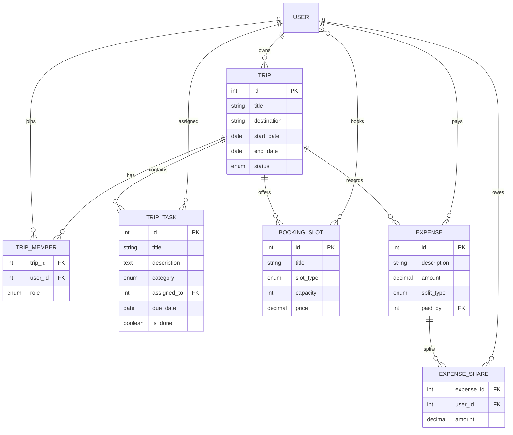

# TripMate data model and API contract

This document is the contract between the Flutter client and the Django API.
The API accepts OIDC access tokens issued by `django-oidc-provider` in the
`Authorization: Bearer <access_token>` header.

## ER diagram



## Enumerations

- `Trip.status`: `upcoming`, `ongoing`, `done`
- `TripMember.role`: `owner`, `member`
- `TripTask.category`: `urgent`, `work`, `team`
- `Expense.split_type`: `equal`, `custom`
- `BookingSlot.slot_type`: `transport`, `accommodation`, `activity`

## Authentication

Login uses the OIDC Authorization Code flow with PKCE against `/openid/`
(public client `tripmate-flutter`, redirect URI `http://localhost:50000/callback`).

| Method | Endpoint | Purpose |
| --- | --- | --- |
| GET | `/openid/.well-known/openid-configuration` | Discovery document |
| GET | `/openid/authorize` | Authorization endpoint (login + consent page) |
| POST | `/openid/token` | Exchange the code (with PKCE verifier) for tokens |
| GET | `/openid/userinfo` | Claims of the signed-in user |
| GET | `/openid/end-session` | RP-initiated logout |

## Trip and planner endpoints

| Method | Endpoint | Purpose |
| --- | --- | --- |
| GET | `/api/trips/` | List trips for the signed-in user |
| POST | `/api/trips/` | Create a trip |
| GET | `/api/trips/{trip_id}/` | Read one trip |
| PATCH | `/api/trips/{trip_id}/` | Update a trip (owner only) |
| DELETE | `/api/trips/{trip_id}/` | Delete a trip (owner only) |
| GET | `/api/trips/{trip_id}/tasks/` | List checklist tasks |
| POST | `/api/trips/{trip_id}/tasks/` | Create a task |
| PATCH | `/api/tasks/{task_id}/` | Update task status or assignment |
| DELETE | `/api/tasks/{task_id}/` | Delete a task |
| GET | `/api/trips/{trip_id}/slots/` | List booking slots |
| POST | `/api/trips/{trip_id}/slots/` | Create a booking slot |
| POST | `/api/slots/{slot_id}/book/` | Book one available slot atomically |

## Expenses and settlement

`POST /api/trips/{trip_id}/expenses/` accepts `description`, `amount`, and optional
`split_type` and `shares`. When `shares` is omitted, the server creates equal
shares for every current trip member and assigns any rounding remainder to the
first member.

| Method | Endpoint | Purpose |
| --- | --- | --- |
| GET | `/api/trips/{trip_id}/expenses/` | List expenses and shares |
| POST | `/api/trips/{trip_id}/expenses/` | Create an expense |
| GET | `/api/expenses/{expense_id}/` | Read one expense |
| PATCH | `/api/expenses/{expense_id}/` | Edit an expense (payer or trip owner) |
| DELETE | `/api/expenses/{expense_id}/` | Delete an expense (payer or trip owner) |
| GET | `/api/trips/{trip_id}/settlement/` | Return minimum transfers |

Settlement responses contain:

```json
{
  "transfers": [
    {"from_user": 7, "to_user": 3, "amount": "125.00"}
  ]
}
```

## Sprint status

- Sprint 1: OIDC authentication (Authorization Code + PKCE) and Trip CRUD are implemented.
- Sprint 2: Task/checklist API and Planner integration are implemented.
- Sprint 3: Booking slots with `select_for_update` are implemented.
- Sprint 4: Expenses, equal splitting, and settlement calculation are implemented.
- Sprint 5: Notifications, CI, and end-to-end testing remain.
